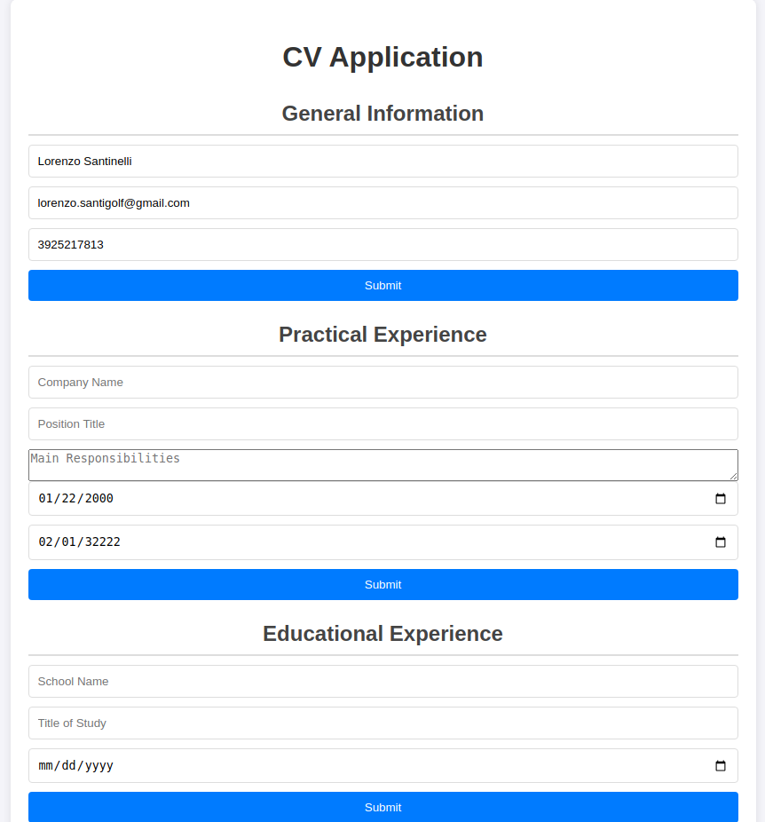

# CV Application

A simple and elegant CV application built with React and Vite. This application allows users to input and display their general information, educational background, and work experience.

## Screenshot


## Technologies Used
- React
- Vite
- CSS

## Features:
### Required Features
- Input and display general information (name, email, phone)
- Input and display educational background (school, title, date)
- Input and display work experience (company, position, responsibilities, from, until)

### Additional Features
- Edit mode for each section
- Responsive design
- Form validation

## Installation
1. Clone the repository:
   ```sh
   git clone https://github.com/Santix123123/cv_application.git

### Live Demo:
